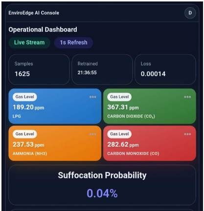
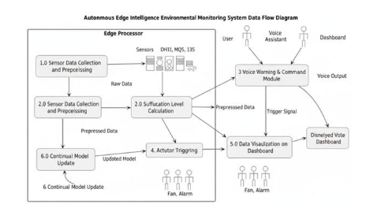
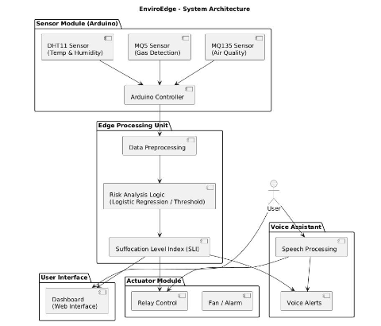
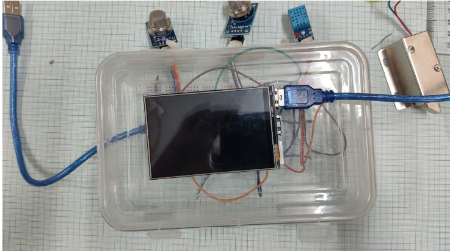
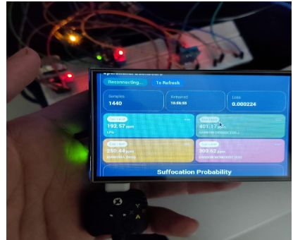

# EnviroEdge AI


**EnviroEdge AI** is an end to end IoT platform for real time environmental monitoring and suffocation risk detection. Arduino sensors stream air quality readings over USB serial to a Node.js backend, which estimates gas concentrations and risk probability using logistic regression with optional online retraining and displays live metrics on a Next.js dashboard.


## Features

- **Multi sensor ingestion** — MQ-5, MQ-135, and DHT11 (temperature/humidity) via Arduino serial (9600 baud)
- **Risk scoring** — Logistic regression outputs a suffocation / hazardous condition probability
- **Gas concentration estimates** — RS-ratio formulas for LPG, CO, methane, hydrogen, NH₃, CO₂, and alcohol
- **Edge inference** — Deploy trained weights on Arduino for on device alerts (GPIO when risk ≥ 20%)
- **Online learning** — Backend buffers labeled samples and retrains periodically when validation loss improves
- **Live dashboard** — 1-second refresh, trend charts, model version / sample count / validation loss
- **Hardware alerts** — LED outputs and optional buzzer firmware

## Architecture

```
┌─────────────────┐     USB Serial      ┌──────────────────┐     HTTP      ┌─────────────────┐
│  Arduino +      │ ──────────────────► │  Express API     │ ◄───────────► │  Next.js        │
│  MQ-5/MQ-135/   │   CSV sensor rows   │  SerialPort +    │   proxy API   │  Dashboard      │
│  DHT11          │                     │  edgeIntelligence│               │  (Recharts)     │
└─────────────────┘                     └──────────────────┘               └─────────────────┘
        │                                         │
        └── GPIO (LED / buzzer)                   └── edge-model-state.json
```

## Tech Stack

| Layer | Technologies |
|-------|----------------|
| Hardware | Arduino, MQ-5, MQ-135, DHT11 |
| Embedded ML | Logistic regression (C++), optional TensorFlow Lite (`Model/model.h`) |
| ML / training | Python, pandas, scikit-learn, Jupyter (`comfortjett.ipynb`) |
| Backend | Node.js, Express, SerialPort |
| Frontend | Next.js 14, React 18, TypeScript, Tailwind CSS, Recharts |

## Project Structure

```
Enviroedge/
├── backend/                 # Express API, serial reader, online learning
│   ├── controllers/         # Probability, gas, snapshot handlers
│   ├── services/            # edgeIntelligence.js (retrain + predict)
│   ├── routes/
│   └── data/                # Persisted model state (edge-model-state.json)
├── frontend/                # EnviroEdge AI dashboard (primary UI)
├── sensor_codes/            # Arduino sketches (read_data, buzzer)
├── Model/
│   └── detection/           # ML + alert firmware (detection.ino)
├── sensor_training_data.csv # Labeled training dataset (~3.9k rows)
├── comfortjett.ipynb        # Model training & evaluation notebook
└── next-dashboard-ui/       # Alternate dashboard scaffold
```

## Hardware Setup

### Sensors

| Sensor | Purpose |
|--------|---------|
| **MQ-5** | LPG, methane (analog A0, digital D5) |
| **MQ-135** | CO, CO₂, NH₃, alcohol (analog A1, digital D6) |
| **DHT11** | Temperature & humidity (pin 4) |

### Firmware

| Sketch | Path | Description |
|--------|------|-------------|
| Raw streaming | `sensor_codes/read_data/read_data.ino` | Sends 6 sensor values (no probability) |
| ML + alerts | `Model/detection/detection/detection.ino` | Computes `p`, streams 7 values, triggers pins 2 & 3 when `p ≥ 0.2` |
| Buzzer | `sensor_codes/buzzer_code/` | Simple buzzer test pattern |

**Serial format (detection firmware):**

```
MQ5A0,MQ5D0,MQ135A0,MQ135D0,DHT11_T,DHT11_H,p
```

Upload the detection sketch before connecting the backend so the `p` label is available for online learning.

## Prerequisites

- [Node.js](https://nodejs.org/) 18+
- Arduino IDE (or PlatformIO) for firmware
- USB cable; note your serial port name (e.g. `COM3` on Windows, `/dev/ttyUSB0` on Linux)

## Getting Started

### 1. Clone the repository

```bash
git clone https://github.com/Mayankgupta1754/enviroedge.git
cd enviroedge
```

### 2. Backend

```bash
cd backend
npm install
```
**Set your serial port** in `backend/controllers/probController.js`:

```js
const PORT_NAME = "COM3"; // e.g. COM3, COM4, /dev/ttyUSB0
```

Start the server:

```bash
npm run server
```

API base: `http://localhost:4000`

### 3. Frontend

```bash
cd frontend
npm install
```

Run the dashboard:

```bash
npm run dev
```

Open [http://localhost:3000](http://localhost:3000) — redirects to the admin operational dashboard.

### 4. Train or refresh the model (optional)

1. Open `comfortjett.ipynb` in Jupyter.
2. Use `sensor_training_data.csv` (columns: `MQ5A0`, `MQ5D0`, `MQ135A0`, `MQ135D0`, `DHT11_T`, `DHT11_H`, `Outcome`).
3. Export logistic regression coefficients into `Model/detection/detection/detection.ino` and/or update defaults in `backend/services/edgeIntelligence.js`.

## API Reference

| Method | Endpoint | Description |
|--------|----------|-------------|
| `GET` | `/` | Health check |
| `POST` | `/api/probability/snapshot` | Probability + all gas concentrations |
| `POST` | `/api/probability/value` | Probability only |
| `POST` | `/api/probability/gas` | Gas concentrations only |
| `GET` | `/api/probability/model-status` | Edge model version, samples, metrics |
| `POST` | `/api/user/login` | User login (JWT; requires MongoDB if enabled) |
| `POST` | `/api/user/register` | User registration |

The Next.js app proxies snapshot and model status via:

- `GET /api/probability/snapshot`
- `GET /api/probability/model-status`

## Machine Learning

### Offline training

- **Dataset:** `sensor_training_data.csv` — binary `Outcome` (0 = no gas leak, 1 = gas leak).
- **Notebook:** `comfortjett.ipynb` — EDA, scaling, Logistic Regression with `GridSearchCV`, Random Forest comparison.
- **Deployment:** Coefficients embedded in Arduino (`detection.ino`) and seeded in `edgeIntelligence.js`.

### Online learning (backend)

`backend/services/edgeIntelligence.js`:

- Appends labeled samples from live serial readings (label derived from `p`).
- Retrains on a schedule (default: every 10 minutes) when enough samples exist.
- Promotes a new model only if validation loss improves.
- Persists state to `backend/data/edge-model-state.json`.

### Gas concentrations

Analog readings are converted using per gas constants (A, B) and an RS-ratio formula in `probController.js`—separate from the ML risk score.

## Dashboard

The **EnviroEdge AI Console** (`frontend/src/app/(dashboard)/admin/page.tsx`) shows:

- Live gas cards (LPG, CO₂, NH₃, CO)
- Suffocation probability (%)
- Risk trend and gas comparison charts
- Edge model stats (version, samples, validation loss, last retrain)

Data refreshes every **1 second**; last valid readings are kept if the serial stream drops.


